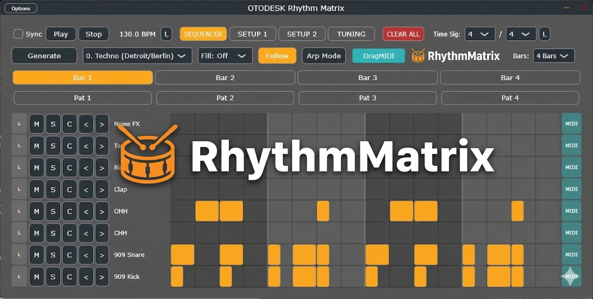

# OTODESK Rhythm Matrix 🥁

**OTODESK Rhythm Matrix** is a powerful, algorithmic drum machine plugin (VST3 / Standalone) built with C++ and the JUCE framework. It generates complex polyrhythms, Euclidean rhythms, and highly musical patterns across 26 different genres using advanced probability and anchor/sub-anchor logic.

OTODESK Rhythm Matrix は、C++とJUCEフレームワークで開発された、アルゴリズミック・ドラムマシン・プラグインです。確率論とアンカーロジックを用いて、複雑なポリリズムやユークリッドリズム、26種類のジャンルに特化した音楽的なビートを自動生成します。

## 開発の背景とスタンス (Philosophy)

この「RhythmMatrix」は、もともと私自身が日々の音楽制作をより便利に、より楽しくするための「個人用ツール」として開発したものです。
しかし、いざ作ってみると予想以上に強力でインスピレーションに溢れたジェネレーティブ・シーケンサーに仕上がったため、「せっかくなら他のクリエイターの方々にも自由に使ってもらいたい！」と思い、完全無料で公開することにしました。

収益化などは一切考えていません。あなたのトラックメイクを加速させる便利ツールとして、ぜひ自由にダウンロードして遊んでみてください！

---

## About This Plugin / Philosophy

"RhythmMatrix" was originally developed purely as a handy personal tool to enhance and speed up my own music production workflow. 
However, it turned out to be such a powerful and inspiring generative sequencer that I thought, "Why not share this with other creators?" That's why I've decided to release it to the world completely for free.

I have no intention of monetizing this. It's simply a tool I built for myself, and if you find it useful, please feel free to use it however you like in your own projects. I hope it sparks new ideas and speeds up your beat-making process. Enjoy!

## ✨ Features (主な機能)
* **26 Genre Algorithms:** Instantly generate patterns for UK Drill, Breakcore, Amapiano, Techno, Math Rock, and more.
* **Polyrhythm & Euclidean Matrix:** Mathematically perfect beat distribution with humanized ghost notes.
* **Complexity & Entropy Controls:** Dynamically adjust the density and randomness of each track.
* **Drag & Drop Samples:** Easily load your own `.wav`, `.mp3`, or `.aif` samples into any of the 8 tracks.
* **MIDI Drag & Drop Export:** Drag patterns directly from the UI into your DAW's timeline.
* **Lightweight UI:** Optimized rendering for smooth performance even with multiple instances.

## 📥 Installation (インストール方法)
Download the latest `.zip` from the [Releases](../../releases) page and extract the `.vst3` file to your plugin folder.

最新のReleaseページからZIPファイルをダウンロードし、以下のフォルダに `.vst3` ファイルを配置してください。

* **Windows:** `C:\Program Files\Common Files\VST3`
* **Ableton Liveで動作確認済み**（使用は自己責任でお願いします。）

*(A Standalone executable is also available for jamming without a DAW. / DAWなしで遊べるスタンドアロン版も同梱しています。)*

## 📖 Documentation (マニュアル)

For a detailed explanation of all features, including the Generative algorithms, Arp mode, and Euclidean matrix, please check the **[Complete Manual](Assets/Rhythm_Matrix_Manual.md)**.

各機能の詳細な使い方、アルペジオモードやチューニング（アルゴリズムの深層設定）の解説については、以下の完全版マニュアルをご覧ください。

👉 **[OTODESK Rhythm Matrix 完全マニュアルを読む](Assets/Rhythm_Matrix_Manual.md)**

## 免責事項 (Disclaimer)

本プラグインの使用により生じたいかなる損害（DAWのクラッシュ、スピーカーやヘッドホン等のオーディオ機器の破損、聴覚への影響、データの消失などを含む）について、開発者は一切の責任を負いません。

オーディオプラグインの性質上、予期せぬ大音量やノイズが発生する可能性があります。初めて使用する際や設定を大きく変更する際は、**必ずスピーカーやインターフェースの音量を十分に下げてから**ご使用ください。
すべて自己責任（Use at your own risk）でのご利用をお願いいたします。

---

The developer assumes no responsibility for any damage or loss caused by the use of this plugin (including but not limited to DAW crashes, damage to speakers/headphones, hearing damage, and data loss).

Due to the nature of audio plugins, unexpected loud noises or feedback may occur. Always **lower the volume of your audio interface or speakers** before using the plugin or making significant parameter changes for the first time.
**Use at your own risk.**

## ⚖️ License (ライセンスと規約)

This project is open-source and released under the **[GPLv3 License](https://www.gnu.org/licenses/gpl-3.0.html)**.
You are free to use, modify, and distribute this software, but any derivative works must also be open-source and licensed under GPLv3.

このプロジェクトは **GPLv3 ライセンス** の下で公開されています。無料で使用・改変・再配布が可能ですが、派生物も同じくGPLv3でオープンソース化する必要があります。

  * Built with [JUCE](https://juce.com/). JUCE is a framework for multi-platform audio applications.
  * To release a closed-source commercial product based on this code, you must acquire an appropriate commercial license from JUCE.

## 🤝 Credits

Developed by OTODESK.

https://x.com/kijyoumusic
